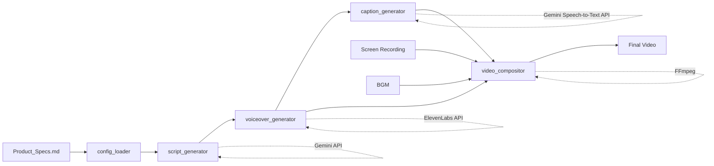

# Product Demo Framework

A modular, config-driven framework for generating professional product demo videos optimized for hackathon presentations.

## 🎯 Overview

This framework automates the creation of 3-minute product demo videos by reading a single configuration file (`Product_Specs.md`) and orchestrating:
- **Script generation** using Gemini API
- **Voiceover synthesis** using ElevenLabs
- **Caption generation** using Gemini Speech-to-Text
- **Video composition** using FFmpeg

**Key Feature:** Reusable across multiple products - just swap out `Product_Specs.md`!

---

## 📁 Directory Structure

```
PRODUCT_DEMO/
├── <PRODUCT_NAME>/                   # Product-specific Runs
│   ├── run_<product>.log             # Execution logs
│   ├── INPUT-<timestamp>/
│   │   ├── configuration/
│   │   │   └── Product_Specs.md      # Configuration file (edit this!)
│   │   ├── raw_recordings/
│   │   └── assets/                   # BGM, logos, etc.
│   └── OUTPUT-<timestamp>/   # Generated artifacts
│       ├── scripts/          # Generated voiceover scripts
│       ├── voiceover/        # Generated audio
│       ├── captions/         # SRT and ASS caption files
│       ├── scenes/           # AI generated scenes
│       └── final_video/      # Final rendered videos
├── framework/                    # Core framework (reusable)
│   ├── config_loader.py          # Parses Product_Specs.md
│   ├── script_generator.py       # Gemini script generation
│   ├── voiceover_generator.py    # ElevenLabs TTS
│   ├── caption_generator.py      # Gemini Speech-to-Text captions
│   ├── video_compositor.py       # FFmpeg composition
│   ├── recording_orchestrator.py # Browser automation helper
│   ├── orchestrator.py           # Main pipeline
│   └── requirements.txt          # Python dependencies
```

---

## 🚀 Quick Start

### 1. Install Dependencies

```bash
cd PRODUCT_DEMO/framework
pip install -r requirements.txt

# Install FFmpeg (macOS)
brew install ffmpeg
```

### 2. Configure Environment

Create `.env` file in project root:

```bash
GEMINI_API_KEY=your-gemini-key
OPENAI_API_KEY=your-openai-key
ELEVENLABS_API_KEY=your-elevenlabs-key
```

### 3. Edit Product_Specs.md

Update `INPUT/configuration/Product_Specs.md` with your product details:
- Product name, URL, tagline
- Problem statement and solution
- Demo scenes with actions
- Judging criteria strategies

### 4. Run Pipeline

```bash
cd framework
python orchestrator.py --config=../INPUT/configuration/Product_Specs.md
```

The pipeline will:
1. ✅ Generate voiceover script (Gemini API)
2. ✅ Create audio narration (ElevenLabs)
3. ✅ Generate captions (Gemini Speech-to-Text API)
4. ⏸️ Pause for screen recording (manual step)
5. ✅ Composite final video (FFmpeg)

---

## 📖 Usage Guide

### Full Pipeline

Run everything in sequence:

```bash
python orchestrator.py \
  --config=../INPUT/configuration/Product_Specs.md \
  --recording=../INPUT/raw_recordings/screen_recording.webm \
  --bgm=../INPUT/assets/background_music.mp3
```

### Resume from Stage

If a stage fails, resume from that point:

```bash
# Resume from voiceover generation
python orchestrator.py --resume-from=voiceover

# Resume from caption generation
python orchestrator.py --resume-from=captions

# Resume from video composition
python orchestrator.py --resume-from=composite --recording=path/to/recording.webm
```

### Skip Stages

Use existing outputs to speed up iteration:

```bash
# Use existing script, regenerate everything else
python orchestrator.py --skip-script

# Use existing voiceover, regenerate captions and video
python orchestrator.py --skip-voiceover
```

### Run Individual Components

Test components independently:

```bash
# Generate script only
python script_generator.py ../INPUT/configuration/Product_Specs.md

# Generate voiceover from script
python voiceover_generator.py ../INPUT/configuration/Product_Specs.md ../OUTPUT/scripts/voiceover_script.md

# Generate captions from audio
python caption_generator.py ../OUTPUT/voiceover/voiceover_raw.mp3

# Composite video
python video_compositor.py \
  ../INPUT/raw_recordings/screen_recording.webm \
  ../OUTPUT/voiceover/voiceover_raw.mp3 \
  ../OUTPUT/captions/captions_styled.ass \
  ../INPUT/assets/bgm.mp3 \
  ../INPUT/configuration/Product_Specs.md
```

---

## 🎬 Screen Recording

### Option 1: Manual Recording

1. Run recording orchestrator to generate instructions:
   ```bash
   python recording_orchestrator.py ../INPUT/configuration/Product_Specs.md
   ```

2. Follow instructions in `INPUT/raw_recordings/RECORDING_INSTRUCTIONS.md`

3. Use QuickTime or OBS to record:
   - **QuickTime:** File → New Screen Recording → Options → Show Mouse Clicks
   - **OBS:** Add Display Capture source, record at 1920x1080

4. Save as `INPUT/raw_recordings/screen_recording.webm` or `.mp4`

### Option 2: Automated (Using Antigravity)

```bash
# Generate browser task
python recording_orchestrator.py ../INPUT/configuration/Product_Specs.md

# Copy output task and use with browser_subagent tool
```

---

## 🎨 Customization

### Voiceover Settings

Edit in `INPUT/configuration/Product_Specs.md`:

```yaml
voiceover:
  voice_id: "Antoni"           # ElevenLabs voice
  pacing_wpm: 145             # Words per minute
  tone: "Educational, confident"
  stability: 0.65                # Voice consistency
  clarity: 0.80                  # Pronunciation clarity
```

### Caption Styling

Edit ASS format in `caption_generator.py`:

```python
# Line 112-113
Style: Default,Montserrat Bold,48,&H00FFFFFF,...
#              ^font        ^size  ^color (white)
```

### Audio Mixing

Edit FFmpeg filter in `video_compositor.py`:

```python
# Line 88-90
[1:a]volume=-6dB[vo];           # Voiceover volume
[2:a]volume=-20dB[bgm];         # BGM volume (ducked)
```

---

## 📊 Troubleshooting

### Script Too Long

**Problem:** Script exceeds target duration

**Solution:**
```bash
# Regenerate with stricter timing
python script_generator.py ../INPUT/configuration/Product_Specs.md

# OR manually edit OUTPUT/scripts/voiceover_script.md
# OR increase pacing_wpm in Product_Specs.md
```

### FFmpeg Errors

**Problem:** `FFmpeg not found` or composition fails

**Solution:**
```bash
# macOS
brew install ffmpeg

# Ubuntu/Debian
sudo apt install ffmpeg

# Verify installation
ffmpeg -version
```

### Caption Sync Issues

**Problem:** Captions don't align with audio

**Solution:**
- Use word-level timestamps (automatic with Gemini Speech-to-Text API)
- Check audio file hasn't been trimmed after caption generation
- Regenerate captions from original voiceover file

### API Rate Limits

**Problem:** `429 Too Many Requests` from APIs

**Solution:**
- Gemini: Wait 60 seconds, retry
- ElevenLabs: Check character quota at elevenlabs.io
- Gemini Speech-to-Text: Upgrade to paid tier for higher limits

---

## 🔄 Using for Other Products

### Step 1: Copy Product_Specs.md

```bash
cp INPUT/configuration/Product_Specs.md INPUT/configuration/Product_Specs_MyNewProduct.md
```

### Step 2: Update Configuration

Edit new file:
- Product name, URL, tagline
- Problem and solution
- Demo scenes (adjust timing and actions)
- Judging criteria strategies

### Step 3: Run Pipeline

```bash
python orchestrator.py --config=../INPUT/configuration/Product_Specs_MyNewProduct.md
```

### Template Sections to Update

| Section | What to Change |
|---------|---------------|
| **Product Information** | Name, URL, tagline, category |
| **Problem Statement** | Market data, pain points |
| **Solution Overview** | How your product solves the problem |
| **Demo Scenes** | Scene names, actions, key points |
| **Asset Requirements** | Test credentials, product details |

---

## 📐 Framework Architecture



**Data Flow:**
1. `config_loader` parses Product_Specs.md (from INPUT) → Pydantic models
2. `script_generator` uses config → Gemini API → narration script
3. `voiceover_generator` converts script → ElevenLabs API → MP3
4. `caption_generator` extracts audio → Gemini Speech-to-Text API → SRT/ASS
5. `video_compositor` merges recording + VO + captions + BGM → Final MP4

---

## 🧪 Testing

### Test Config Loader

```bash
python config_loader.py ../INPUT/configuration/Product_Specs.md
```

**Expected Output:**
- Product name, URL, tagline
- Number of scenes and duration
- Judging criteria weights

### Test Script Generation

```bash
python script_generator.py ../INPUT/configuration/Product_Specs.md
```

**Expected Output:**
- Script saved to `OUTPUT/scripts/voiceover_script.md`
- Timing validation report
- Word count and estimated duration

### Test Full Pipeline (Dry Run)

```bash
# Generate script and voiceover, skip video
python orchestrator.py --config=../INPUT/configuration/Product_Specs.md --skip-captions
```

---

## 📦 Output Files

| File | Description | Used By |
|------|-------------|---------|
| `OUTPUT/scripts/voiceover_script.md` | Narration script (Markdown) | Human review, voiceover generator |
| `OUTPUT/voiceover/voiceover_raw.mp3` | Audio narration | Caption generator, compositor |
| `OUTPUT/captions/captions.srt` | Standard subtitle format | ASS converter, backup |
| `OUTPUT/captions/captions_styled.ass` | Styled subtitles (FFmpeg) | Video compositor |
| `OUTPUT/final_video/*_demo_final.mp4` | Final rendered video | Submission! |

---

## 🎯 Best Practices

### Before Running Pipeline

- [ ] Update `.env` with valid API keys
- [ ] Test API access (`python -c "import openai; import elevenlabs"`)
- [ ] Verify FFmpeg installed (`ffmpeg -version`)
- [ ] Review INPUT/configuration/Product_Specs.md for accuracy

### During Script Generation

- [ ] Read generated script aloud to check pacing
- [ ] Verify technical terms are pronounced correctly
- [ ] Ensure Gemini 3 is mentioned prominently (2-3 times)
- [ ] Check that judging criteria are addressed

### During Recording

- [ ] Close all unnecessary browser tabs
- [ ] Hide bookmarks bar for clean UI
- [ ] Use 1920x1080 resolution
- [ ] Move mouse slowly and deliberately
- [ ] Pause 2-3 seconds after each action

### After Composition

- [ ] Watch full video start to finish
- [ ] Verify captions are in sync
- [ ] Check audio levels (VO clear, BGM subtle)
- [ ] Confirm duration is within target (2:55-3:00)
- [ ] Test playback on different devices

---

## 📞 Support

**Issues:**
- **Check Logs:** See `<Product>/OUTPUT-<timestamp>/run_<product>.log` for detailed error messages.
- Config not parsing: Check YAML syntax in embedded blocks
- API errors: Verify keys in `.env` file
- FFmpeg crashes: Check input file formats (prefer MP4/WebM)
- Timing issues: Adjust `pacing_wpm` in Product_Specs.md

**Framework Bugs:**
Open an issue or submit PR at: [Repository URL]

---

**Framework Version:** 1.0.0  
**Last Updated:** 2026-02-08
